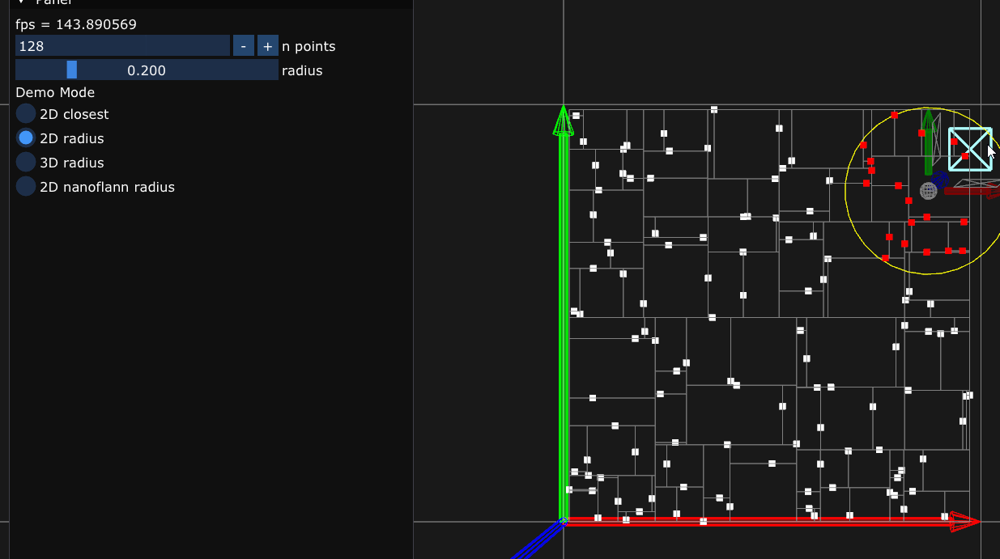
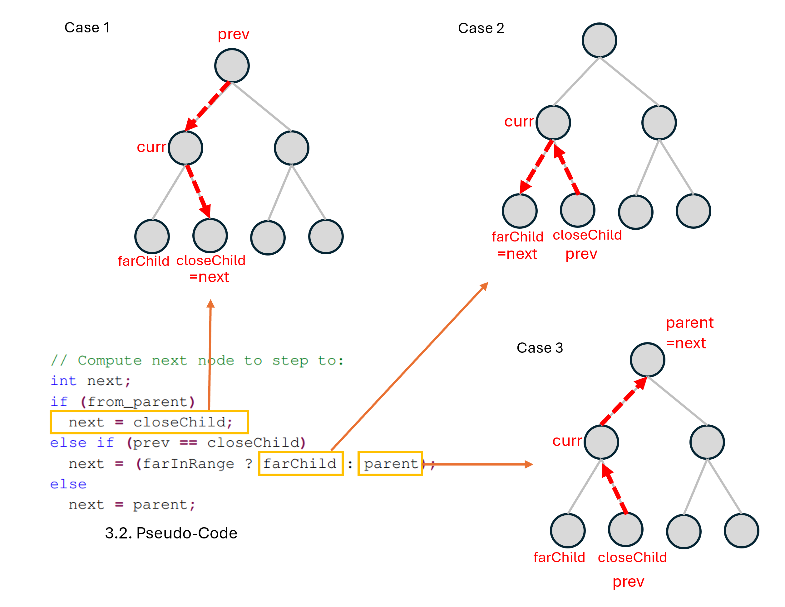

## re-implementation of "A Stack-Free Traversal Algorithm for Left-Balanced k-d Trees"
- minimum
- less templates



## visualization of the idea of the next node to step to



## build

```
git submodule update --init
premake5 vs2022
```

## links
- [A Stack-Free Traversal Algorithm for Left-Balanced k-d Trees](https://jcgt.org/published/0014/01/03/)